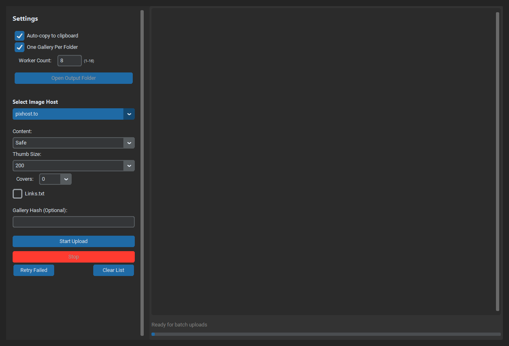
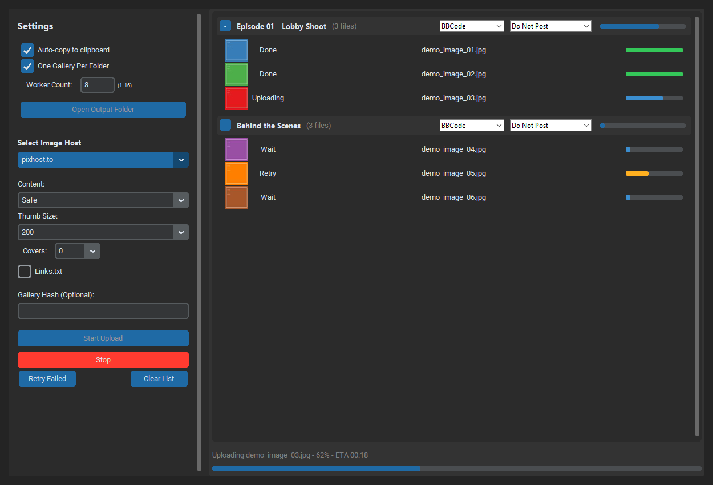
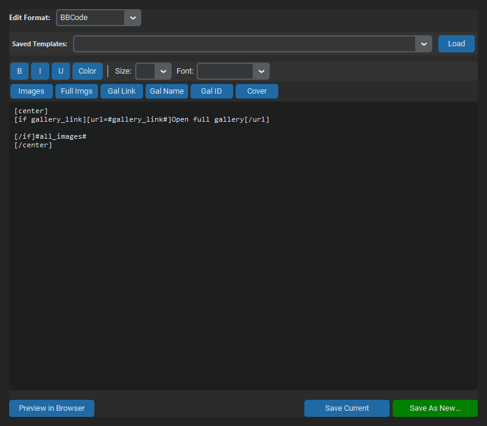

# Connie's Uploader Ultimate


Connie's Uploader Ultimate is a desktop image-uploading tool with a CustomTkinter GUI and a Go sidecar for concurrent uploads. It supports batch uploads, gallery workflows, custom output templates, drag and drop, secure credential storage, and automated release builds for Windows, Linux, and macOS.

**Latest release:** v1.2.4 "CI & Packaging Reliability" (May 20, 2026)

## Screenshots

| Main dashboard | Batch upload queue |
| --- | --- |
|  |  |

| Gallery manager | Template editor |
| --- | --- |
|  |  |

## Features

- Batch upload images by file or folder, with each folder represented as its own upload group.
- Upload through the Go sidecar with worker pools, retry handling, rate limiting, and progress events.
- Manage galleries for supported services and optionally create one gallery per folder.
- Generate BBCode, HTML, Markdown, and custom output formats with the template editor.
- Store credentials through the operating system keyring.
- Save output files to `Output/` and keep history under `~/.conniesuploader/history/`.
- Use dark, light, or system appearance modes.
- Auto-copy completed output to the clipboard.
- Integrate with ViperGirls forum posting workflows.

## Supported Services

The active upload plugins are:

- `imagebam.com`
- `imgur.com`
- `imx.to`
- `pixhost.to`
- `turboimagehost`
- `vipr.im`

## Latest Changelog

### v1.2.4 - CI & Packaging Reliability

Released May 20, 2026.

**Fixed**

- Updated `tkinterdnd2` to `0.4.3` so PyInstaller builds no longer crash while importing the removed legacy `tkinter.tix` module path.
- Kept drag-and-drop support bundled through the existing PyInstaller `--collect-all tkinterdnd2` flow.
- Normalized Windows short-path and macOS `/private/var` path assertions in the Python test suite.
- Mocked GUI success dialogs in menu removal tests so headless Windows/macOS CI runs do not stall.
- Aligned validation expectations for safe filename fallbacks, dangerous characters, and thread-count limits.

**Security**

- Updated `Pillow` to `12.2.0` for current image-processing security fixes.
- Replaced Safety dependency scanning with `pip-audit==2.10.0` in CI and security workflows.

**Changed**

- Pinned `flake8==7.1.1` for stable lint output in CI.
- Refreshed release documentation, download links, and tag examples for `v1.2.4`.

Full history is available in [CHANGELOG.md](CHANGELOG.md).

## Installation

### Download a Release

Download the latest release from [GitHub Releases](https://github.com/conniecombs/ConniesUploader/releases/tag/v1.2.4).

Expected release artifacts:

- `ConniesUploader-v1.2.4-windows-x64.zip`
- `ConniesUploader-v1.2.4-linux-x64.tar.gz`
- `ConniesUploader-v1.2.4-macos-x64.zip`

Each release artifact includes a SHA256 checksum.

### Build from Source

Prerequisites:

- Python 3.11+
- Go 1.25+

Windows:

```bat
build_uploader.bat
```

Linux/macOS:

```bash
./build.sh
```

Makefile:

```bash
make build
```

Useful build-script options:

- `--clean` cleans build artifacts before building.
- `clean` removes build artifacts and exits.
- `--ci` runs without interactive pauses or opening `dist/`.

Manual development run:

```bash
go build -ldflags="-s -w" -o uploader .
python -m venv venv
venv\Scripts\activate
pip install -r requirements.txt
python main.py
```

On Linux/macOS, activate the environment with `source venv/bin/activate` and build the sidecar as `uploader`.

## Usage

1. Set service credentials from `Tools > Set Credentials`.
2. Choose an image host from the service dropdown.
3. Add files or folders with `File > Add Files`, `File > Add Folder`, or drag and drop.
4. Adjust gallery, thumbnail, thread, and output settings as needed.
5. Click `Start Upload`.
6. Review generated output in `Output/` or the history directory.

Additional tools are available from the application menus:

- `Tools > Manage Galleries`
- `Tools > Template Editor`
- `Tools > Viper Tools`
- `Tools > Install Context Menu` on Windows
- `View > Execution Log`

## Configuration and Data

- Application settings are stored in `user_settings.json`.
- Credentials are stored through the system keyring.
- Session output is written to `Output/`.
- Persistent output history is written to `~/.conniesuploader/history/`.
- Runtime crash logs are written to `crash_log.log` when applicable.

## Architecture

Connie's Uploader uses a hybrid desktop architecture:

- `main.py` starts the Python GUI.
- `modules/ui/` contains the CustomTkinter interface.
- `modules/plugins/` contains service plugins and plugin helpers.
- `modules/sidecar.py` manages the Go sidecar process.
- `main.go` and `handlers.go` provide the Go sidecar entry point and request handlers.
- `core/` contains shared Go upload utilities such as validation, retry, rate limiting, HTTP helpers, and output handling.
- `services/` contains Go service integrations.
- Python and Go communicate through JSON events over standard input and output.

## CI, Security, and Releases

GitHub Actions workflows:

- [CI - Build and Test](.github/workflows/ci.yml)
- [Release - Build and Publish](.github/workflows/release.yml)
- [Security Scanning](.github/workflows/security.yml)

The CI workflow builds the Go sidecar on Windows, Linux, and macOS; runs Go vet and Go tests; installs Python dependencies; runs the Python test suite; checks dependencies with `govulncheck` and `pip-audit`; and runs Go/Python linting.

The release workflow builds Windows, Linux, and macOS artifacts, verifies that the sidecar is bundled, calculates SHA256 checksums, packages the artifacts, and publishes a GitHub release.

The security workflow runs CodeQL, gosec, govulncheck, Bandit, pip-audit, dependency review for pull requests, and TruffleHog secret scanning.

## Development

Common commands:

```bash
go test ./...
pytest tests/ -v
flake8 main.py modules/ --max-line-length=120 --ignore=E501,W503 --exclude=__pycache__
```

Build helpers:

```bash
make build
make quick
make clean
```

## Documentation

- [Architecture](ARCHITECTURE.md)
- [Contributing](CONTRIBUTING.md)
- [Changelog](CHANGELOG.md)
- [Build Troubleshooting](docs/guides/BUILD_TROUBLESHOOTING.md)
- [Plugin Creation Guide](docs/guides/PLUGIN_CREATION_GUIDE.md)
- [Schema Plugin Guide](docs/guides/SCHEMA_PLUGIN_GUIDE.md)
- [Release Process](docs/releases/RELEASE_PROCESS.md)
- [Documentation Index](docs/README.md)

## Troubleshooting

**`uploader.exe` or `uploader` not found**

Build the Go sidecar with `go build -ldflags="-s -w" -o uploader.exe .` on Windows or `go build -ldflags="-s -w" -o uploader .` on Linux/macOS.

**Uploads fail immediately**

Check credentials, confirm the selected service settings, and open `View > Execution Log` for the sidecar error message.

**Build fails**

Confirm Python 3.11+ and Go 1.25+ are installed, then rerun the appropriate build script with `--clean`.

**Dependency installation fails**

Recreate the virtual environment and reinstall from `requirements.txt`.

## Contributing

Contributions are welcome. See [CONTRIBUTING.md](CONTRIBUTING.md) for development setup, coding standards, and pull request guidance.

## License

This project is licensed under the MIT License. See [LICENSE](LICENSE) for details.

## Acknowledgments

- [CustomTkinter](https://github.com/TomSchimansky/CustomTkinter)
- [tkinterdnd2](https://github.com/pmgagne/tkinterdnd2)
- [goquery](https://github.com/PuerkitoBio/goquery)
- [loguru](https://github.com/Delgan/loguru)
- [logrus](https://github.com/sirupsen/logrus)
- [imaging](https://github.com/disintegration/imaging)

## Responsible Use

This tool is intended for personal use and legitimate content sharing. Users are responsible for following the terms of service for each image hosting platform they use.
