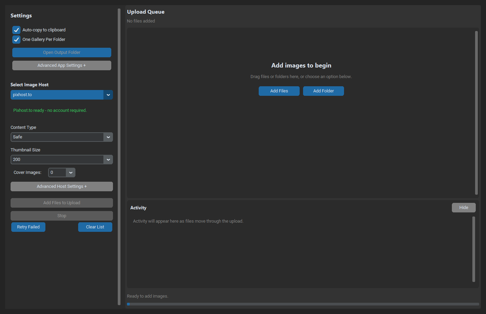
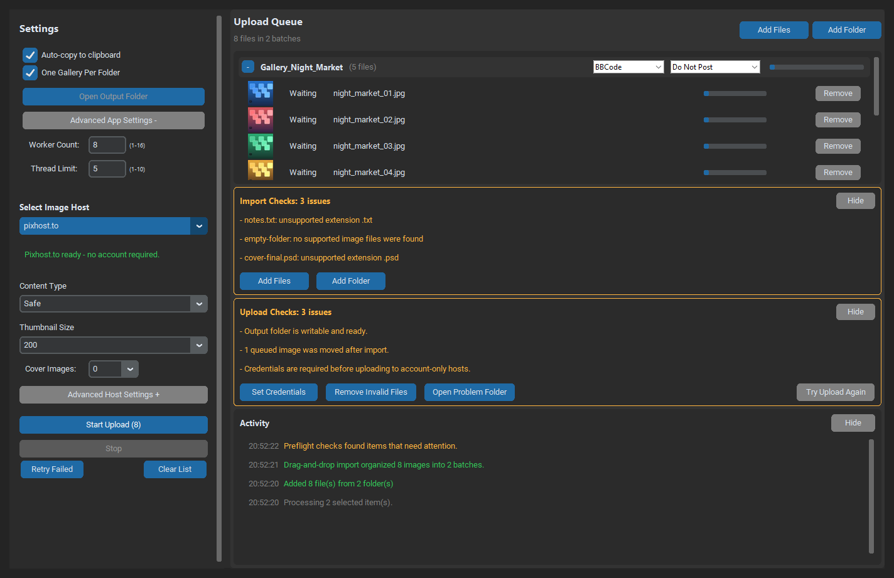
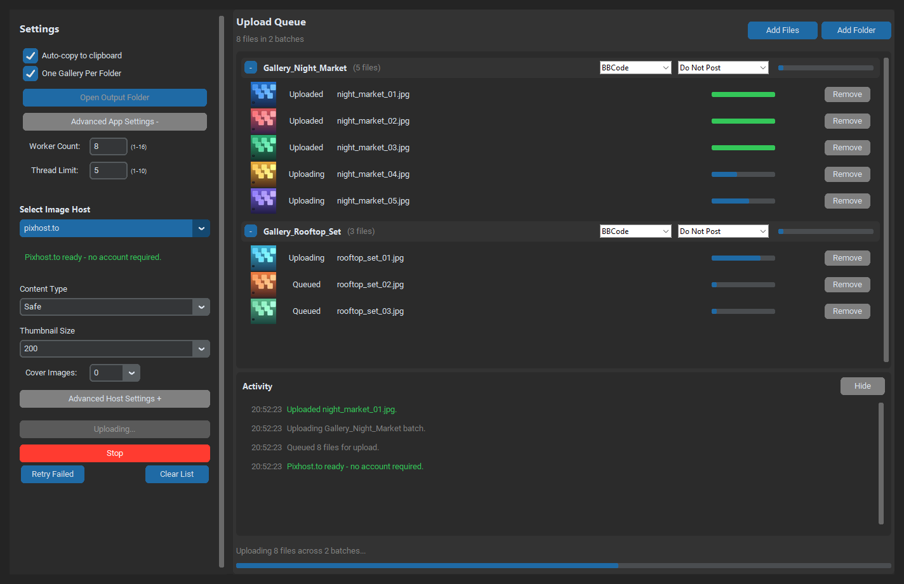
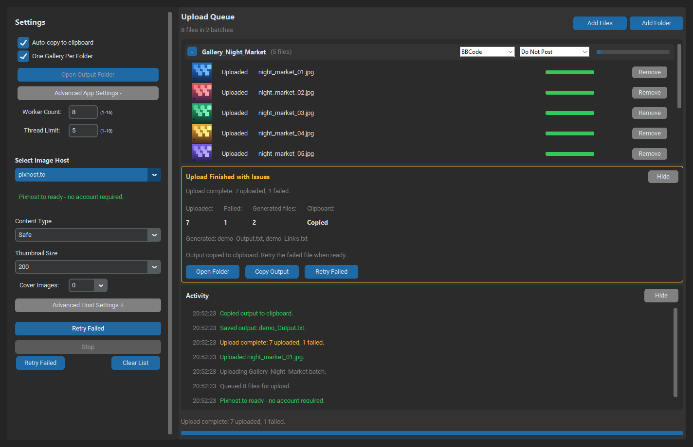
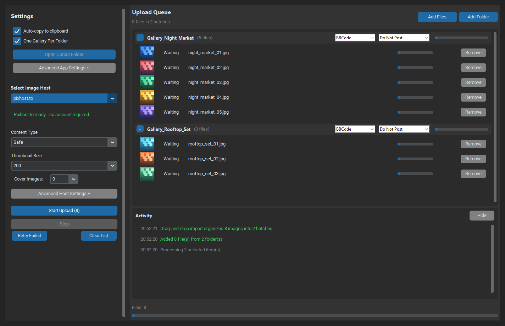
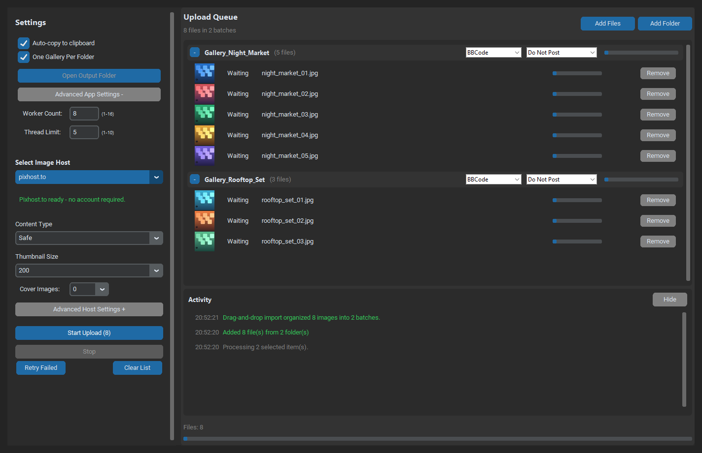
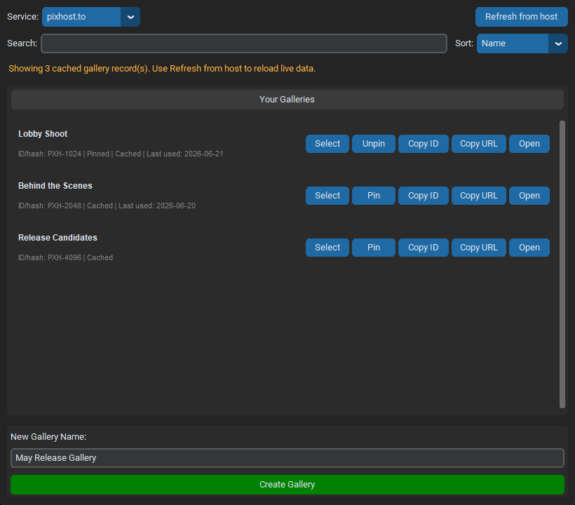
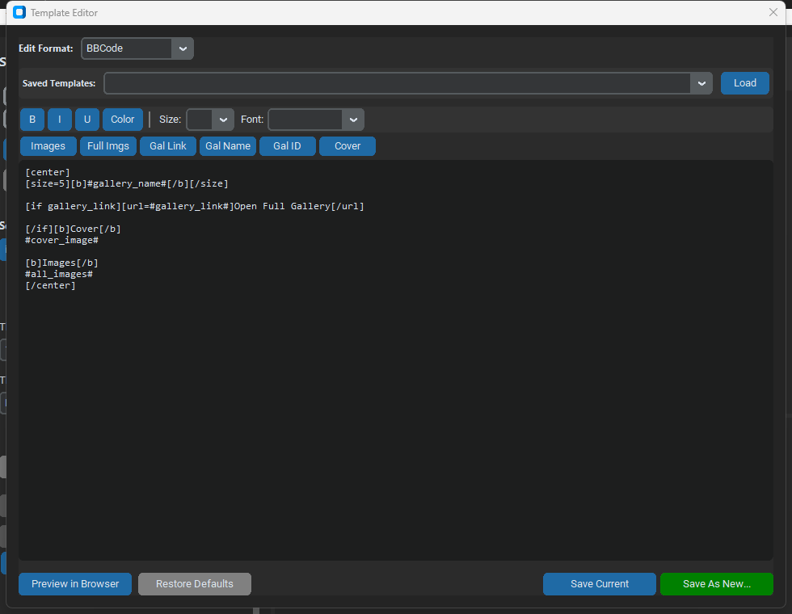

# Connie's Uploader Ultimate User Tutorial

This tutorial walks through Connie's Uploader Ultimate from first launch through batch uploads, galleries, templates, output files, ViperGirls posting, and every setting exposed by the current desktop app.

The program is a desktop image uploader. You add image files or folders, choose an image host, adjust service settings, start the upload, and receive formatted output text such as BBCode, Markdown, HTML, or a custom template.

If you are new, do not start by changing every setting. Use the first example below exactly once, confirm output is created, then adjust settings for your real workflow.

## Start Here: Safest First Upload

This example avoids credentials, galleries, and forum posting. It proves the app, sidecar, queue, upload host, template engine, and output folder are working.

1. Open Connie's Uploader.
2. Set `Select Image Host` to `pixhost.to`.
3. Leave `One Gallery Per Folder` off.
4. Leave ViperGirls thread dropdowns at `Do Not Post`.
5. Set `Worker Count` to `1`.
6. Add 2 or 3 small `.jpg` or `.png` files with `File > Add Files`.
7. Leave the batch template as `BBCode`.
8. Click `Start Upload`.
9. When the upload finishes, click `Open Output Folder`.
10. Open the generated `.txt` file and confirm it contains links that look like this:

```bbcode
[url=https://...][img]https://...[/img][/url]
```

If this works, the basic app is working. After that, move to folders, galleries, covers, or ViperGirls posting.

### What Not To Touch On A First Test

Leave these alone until a simple upload works:

- Gallery IDs or gallery hashes.
- ViperGirls posting targets.
- Custom templates.
- High worker counts.
- `One Gallery Per Folder`.
- Existing account-only gallery features.

### Basic Terms

| Term | Meaning |
| --- | --- |
| Batch | A group of images uploaded together. A folder usually becomes one batch. |
| Host | The image site, such as `pixhost.to`, `imx.to`, or `vipr.im`. |
| Template | The text layout generated after upload, such as BBCode for forums. |
| Cover | One or more images shown first/larger in template output. Covers are not duplicated in `#all_images#`. |
| Gallery | A host-side album/folder, when the selected image host supports it. |
| Sidecar | The bundled Go uploader process that performs the upload work. |
| Output | The final generated text file saved in `Output/`. |

## Main Window



The window is split into two main areas:

- The left settings panel controls output behavior, worker count, selected host, and service-specific upload options.
- The large right panel is the upload queue. Added files appear here as batches, with thumbnails, status labels, progress bars, per-batch template selection, and optional ViperGirls posting selection.

The bottom status text shows the current state, such as `Ready...`, `Processing...`, `Files: 5`, `Starting...`, or `All batches finished.` The bottom progress bar shows total upload progress.

## Basic Upload Workflow

Use this checklist for every upload.

### Before You Click Start



1. Choose the image host.
2. Confirm credentials if the host needs them.
3. Add files or folders.
4. Confirm each batch has the right files.
5. Reorder images if the output order matters.
6. Mark covers if you want cover images.
7. Choose the template for each batch.
8. Choose a ViperGirls target only if you want automatic posting.
9. Check `Worker Count`. Use `1` for testing, `4-8` for normal use.
10. Read Upload Checks if the app shows them.

### During Upload



Watch the row status labels:

| Status | Meaning |
| --- | --- |
| `Wait` | The file has not started yet. |
| `Uploading` | The sidecar is currently uploading that file. |
| `Done` | The host returned a usable upload result. |
| `Failed` | The host or app returned an error for that file. |
| `Timeout` | The upload took too long or stopped responding. |

If one file fails, let the batch finish. Use `Retry Failed` afterward.

### After Upload



1. Open `Output/`.
2. Open the newest `.txt` file for the batch.
3. Copy the generated text if auto-copy was off.
4. Paste it wherever you need it, such as a forum post editor.
5. If anything failed, use `Retry Failed` before clearing the queue.

### Example: Upload One Folder To Pixhost

Use this when you have one folder named `Example Set` with 10 images.

1. Select `pixhost.to`.
2. Set `Content` to the correct value, usually `Safe` or `Adult`.
3. Set `Thumb Size` to `250`.
4. Set `Auto Covers` to `0` if you do not need covers.
5. Click `File > Add Folder`.
6. Choose the `Example Set` folder.
7. Confirm one batch appears named `Example Set`.
8. Set the batch template to `BBCode`.
9. Leave the thread dropdown at `Do Not Post`.
10. Click `Start Upload`.

Expected result:

- One output file appears in `Output/`.
- The output file contains clickable BBCode thumbnails.
- No ViperGirls post is created.

### Example: Upload Several Folders As Separate Batches

Use this when you have folders like `Set 01`, `Set 02`, and `Set 03`.

1. Select the host.
2. Turn on `One Gallery Per Folder` only if the host supports galleries and you want one gallery for each folder.
3. Click `File > Add Folder`.
4. Choose the parent folder that contains `Set 01`, `Set 02`, and `Set 03`.
5. If the app asks how to scan, choose the option that adds immediate subfolders as batches.
6. Confirm each folder appears as its own batch.
7. Choose a template per batch.
8. Click `Start Upload`.

Expected result:

- Each folder gets its own output `.txt` file.
- If gallery creation was enabled and supported, each folder gets its own gallery.

## Adding Files And Folders

Use `File > Add Files` to select individual images. Selected loose files go into one `Miscellaneous` batch unless `View > Separate Batches for Files` is enabled.

Use `File > Add Folder` to add an entire folder. The program scans the folder for supported image formats and creates a batch named after the folder. If the selected folder contains subfolders, the app may ask whether to scan recursively or add each immediate subfolder as its own batch.

You can also drag files or folders into the main window or queue area.

Supported extensions are:

```text
.jpg, .jpeg, .png, .gif, .bmp, .webp
```

The app validates files before adding them. The default per-file size limit is 50 MB, and a single scan is capped at 1000 files.

## Upload Queue



Each batch header contains:

- Collapse/expand button: hides or shows the files in that batch.
- Batch name: usually the folder name or `Miscellaneous`.
- File count or completion state.
- Template dropdown: chooses the output template for that batch.
- Thread dropdown: chooses a saved ViperGirls thread or `Do Not Post`.
- Batch progress bar.

Each file row contains:

- A thumbnail preview or `[Img]` placeholder.
- A status label such as `Wait`, `Uploading`, `Done`, `Failed`, or `Timeout`.
- The file name.
- A `Set Cover` button that marks that image as a cover for templates and cover-size uploads.
- A file progress bar.

Queue actions:

- Drag batch headers to reorder batches.
- Drag file rows to reorder files or move them between batches.
- Use `Set Cover` on one or more rows to choose cover images manually. Right-click selected rows to mark or clear covers in bulk.
- Right-click a batch and choose `Delete Batch` to remove it.
- Right-click a file and choose `Delete Image` to remove that file.
- `Retry Failed` resets failed files to pending and starts another upload pass.
- `Clear List` removes all batches, queued files, generated progress, and current output references.

### Example: Reorder Images Before Upload

Use this when the forum post should show images in a specific order.

1. Add your folder or files.
2. Expand the batch if it is collapsed.
3. Drag image rows up or down until the order is correct.
4. If you need to move several files together, select them first with `Ctrl+click` or `Shift+click`.
5. Drag the selected files to the new position.
6. Start the upload.

The output follows the queue order. If cover images are selected, covers are placed first for upload/output handling and are excluded from `#all_images#` when the template uses cover placeholders.

### Example: Use Multiple Cover Images

Use this when you want 1, 2, 4, or more larger/featured images at the top of a post.

1. Add a batch.
2. Click `Set Cover` on each image that should be a cover.
3. Make sure the selected covers are the images you want featured.
4. Use a template that contains `#cover_images#`.
5. Start the upload.

Recommended template:

```bbcode
[center][b]#batch_name#[/b]

#cover_images#

#all_images#[/center]
```

What happens:

- If you select 1 cover, one cover appears.
- If you select 4 covers, four covers appear.
- If you select no covers, the cover section is empty.
- Cover images are not repeated in `#all_images#`.
- Cover uploads use the largest supported cover thumbnail size for the selected host.

Use repeated `#cover_image#` only when you need a fixed number of cover slots. For most users, `#cover_images#` is easier.

## Main Settings



These settings appear at the top of the left panel.

| Setting | What it does | When to use it |
| --- | --- | --- |
| `Auto-copy to clipboard` | Copies completed output text to the clipboard. Multiple completed batches are copied with blank lines between them. | Enable when you usually paste results into a forum, CMS, chat, or document immediately after upload. |
| `One Gallery Per Folder` | Tries to create a separate gallery for each batch/folder on services that support gallery creation. | Enable for folder-based uploads where each folder should become its own gallery. |
| `Worker Count` | Sets the Go sidecar's global worker pool count. The sidecar clamps this to 1 through 16 workers. | Use lower values for fragile services, slower networks, or strict rate limits. Use higher values for faster bulk uploads when the host tolerates it. |
| `Open Output Folder` | Opens the `Output/` directory after output files have been generated. It is disabled until there is output to open. | Use after a completed upload to inspect generated `.txt` files. |
| `Select Image Host` | Chooses the active upload service. The service-specific settings below change based on this selection. | Set this before starting the upload. |

### Worker Count Guidance

`Worker Count` controls the persistent Go sidecar process that performs upload work. A value of `1` is the most conservative and effectively forces sequential uploads. Values such as `4` or `8` are better for normal batches. Values near `16` are only useful when the host and network can handle that much concurrency.

## Service Settings

The service settings panel changes when you choose a host from `Select Image Host`.

### Which Host Should I Pick?

Use this as a starting point:

| Goal | Suggested host | Why |
| --- | --- | --- |
| First test with no login | `pixhost.to` | No credentials required and simple settings. |
| Forum thumbnails with galleries | `pixhost.to`, `imx.to`, or `vipr.im` | These have gallery-related workflows in the app. |
| Largest cover thumbnails | `vipr.im` or `turboimagehost` | Current cover settings expose larger cover thumbnail sizes. |
| Account-based Vipr gallery workflow | `vipr.im` | Requires saved Vipr credentials. |
| Imgur testing | `imgur.com` | Available through plugin metadata, but use a small test batch first. |

If you are not sure, start with `pixhost.to`, upload 2 files, and check the output.

### `imx.to`

`imx.to` requires an API key for uploads. Username/password are also used for gallery management and automatic gallery creation.

| Setting | Options | Explanation |
| --- | --- | --- |
| `Thumb Size` | `100`, `180`, `250`, `300`, `600` | Thumbnail width used by IMX output links. Larger values produce larger thumbnails in generated output. |
| `Format` | `Fixed Width`, `Fixed Height`, `Proportional`, `Square` | Controls how IMX creates thumbnails. Use `Fixed Width` for most forum posts. Use `Square` when you need uniform grid thumbnails. |
| `Auto Covers` | `0` through `10` | Marks the first N files as covers when they are added. Manual row-level cover choices can override this per batch. Cover uploads use larger thumbnail settings. |
| `Links.txt` | On/off | Also writes a raw link list file next to the formatted output file. |
| `Gallery ID` | Text field | Existing IMX gallery ID. Leave blank unless you want the upload attached to a specific gallery. |

If `One Gallery Per Folder` is enabled, the app tries to create a new IMX gallery for each batch using the batch title. This requires IMX username/password credentials, not just the API key.

### `pixhost.to`

Pixhost does not require credentials.

| Setting | Options | Explanation |
| --- | --- | --- |
| `Content` | `Safe`, `Adult` | Marks the upload content type. Choose accurately for the host's rules. |
| `Thumb Size` | `150`, `200`, `250`, `300`, `350`, `400`, `450`, `500` | Thumbnail size used by Pixhost output links. |
| `Auto Covers` | `0` through `10` | Marks the first N files as covers when they are added. Manual row-level cover choices can override this per batch. |
| `Links.txt` | On/off | Also writes a raw link list file next to the formatted output file. |
| `Gallery Hash (Optional)` | Text field | Existing Pixhost gallery hash. Leave blank for no manual gallery. |

If `One Gallery Per Folder` is enabled, the app creates a Pixhost gallery for each batch and finalizes created Pixhost galleries after uploads finish.

### `turboimagehost`

TurboImageHost login is optional.

| Setting | Options | Explanation |
| --- | --- | --- |
| `Thumb Size` | `150`, `200`, `250`, `300`, `350`, `400`, `500`, `600` | Thumbnail size used by TurboImageHost output links. |
| `Auto Covers` | `0` through `10` | Marks the first N files as covers when they are added. Manual row-level cover choices can override this per batch. |
| `Links.txt` | On/off | Also writes a raw link list file next to the formatted output file. |
| `Gallery ID` | Text field | Existing gallery ID, when applicable. |

Add Turbo credentials in `Tools > Set Credentials` if you need account-based uploads or host features that require login.

### `vipr.im`

Vipr requires credentials.

| Setting | Options | Explanation |
| --- | --- | --- |
| `Thumb Size` | `100x100`, `170x170`, `250x250`, `300x300`, `350x350`, `500x500`, `800x800` | Thumbnail dimensions used by Vipr output links. |
| `Auto Covers` | `0` through `10` | Marks the first N files as covers when they are added. Manual row-level cover choices can override this per batch. |
| `Links.txt` | On/off | Also writes a raw link list file next to the formatted output file. |
| `Refresh Galleries / Login` | Button | Logs in with saved Vipr credentials and loads your galleries into the dropdown. |
| Gallery dropdown | `None` plus loaded gallery names | Selects the Vipr gallery to attach uploads to. |

If the gallery list is empty, verify your Vipr credentials in `Tools > Set Credentials`, then click `Refresh Galleries / Login`.

### `imagebam.com`

ImageBam authentication is optional. Without saved credentials, uploads use the available unauthenticated flow when possible.

| Setting | Options | Explanation |
| --- | --- | --- |
| `Content Type` | `Safe`, `Adult` | Marks the upload content type. Choose accurately for the host's rules. |
| `Thumb Size` | `100`, `180`, `250`, `300` | Thumbnail size used by ImageBam output links. |

ImageBam does not expose a `Links.txt` checkbox in the current main panel.

### `imgur.com`

The plugin system discovers `imgur.com`, so it can appear in the host dropdown. In the current main window implementation, there is no dedicated Imgur settings panel in the static service settings area. The plugin metadata supports anonymous/authenticated upload concepts, thumbnail sizes, content type, album ID, and titles, but those controls are not exposed in this main settings panel yet.

If you choose Imgur, verify the behavior with a small test batch before relying on album or content-type settings.

## Credentials

Open credentials with `Tools > Set Credentials`.

The credentials dialog saves secrets through the operating system keyring instead of storing passwords in `user_settings.json`.

Credential tabs:

| Tab | Fields | Used for |
| --- | --- | --- |
| `imx.to` | `IMX API Key`, `Username`, `Password` | IMX uploads, gallery listing, gallery creation, and attaching uploads to galleries. |
| `ViperGirls` | `Username`, `Password` | Automatic forum posting through ViperGirls tools. |
| `Turbo` | `Username`, `Password` | Optional TurboImageHost authenticated uploads. |
| `Vipr` | `Username`, `Password` | Vipr uploads and gallery refresh. |
| `ImageBam` | `Email/User`, `Password` | Optional ImageBam authenticated uploads. |

Use `Save All` to store all fields. Use `Cancel` to close without saving changes.

### Credential Examples

Use these examples to decide what to fill in:

| Workflow | Credentials needed |
| --- | --- |
| Pixhost upload only | None. |
| IMX upload only | IMX API key. |
| IMX gallery listing or gallery creation | IMX username and password, plus API key for uploads. |
| Vipr upload or gallery refresh | Vipr username and password. |
| ViperGirls automatic posting | ViperGirls username and password. |
| TurboImageHost account upload | Turbo username and password. |
| ImageBam account upload | ImageBam email/user and password. |

If a feature says credentials are missing after you saved them, close and reopen the app once, then try again.

## Gallery Manager



Open it with `Tools > Manage Galleries`.

The Gallery Manager supports `imx.to`, `pixhost.to`, and `vipr.im`, but each service exposes different gallery features.

| Service | Gallery Manager support |
| --- | --- |
| `imx.to` | List, select, create, and load additional pages. |
| `vipr.im` | List, select, and create with saved Vipr credentials. |
| `pixhost.to` | Create new galleries and return their gallery hash. Listing existing Pixhost galleries is not available yet. |

Controls:

- `Service`: choose which host's galleries to show.
- `Refresh`: reload gallery data for services that support listing.
- `Search`: filter the visible gallery list by name, ID/hash, or URL.
- `Sort`: order visible galleries by name, ID/hash, or last used date when that data is available.
- `Your Galleries`: lists fetched galleries and their IDs/hashes.
- `Select`: sends the chosen gallery ID/hash back to the main window.
- `Copy ID`: copies the gallery ID/hash.
- `Copy URL`: copies the gallery URL when the host returned or can build one.
- `Open`: opens the gallery in your browser when a URL is known.
- `New Gallery Name`: name to use when creating a new gallery.
- `Create Gallery`: creates a gallery on the selected service. After creation, the new gallery is shown by itself with `Select`, `Copy ID`, `Copy URL`, and `Open` actions.
- `Load Next Page`: appears for IMX gallery pagination.
- `Set Credentials`: appears when saved credentials are missing or rejected.
- `Set IMX Cookie Manually`: appears for IMX login failures; it lets you paste a `PHPSESSID` cookie value for the current Gallery Manager session.

Use Gallery Manager when you want to attach a batch to an existing gallery or create a gallery before uploading.

### Example: Attach Uploads To An Existing Gallery

Use this when the gallery already exists on the image host.

1. Open `Tools > Manage Galleries`.
2. Choose a service that supports listing, such as `imx.to` or `vipr.im`.
3. Click `Refresh`.
4. Select the gallery from `Your Galleries`.
5. Click `Select`.
6. Confirm the gallery ID/hash appears in the service settings panel.
7. Add files and upload.

Expected result:

- Uploaded images are attached to that selected gallery when the service supports it.
- The generated template can use `#gallery_link#`, `#gallery_name#`, and `#gallery_id#`.

### Example: One Gallery Per Folder

Use this when each folder should become its own gallery.

1. Enable `One Gallery Per Folder`.
2. Choose a gallery-capable host.
3. Make sure any required credentials are saved.
4. Add folders, not loose individual files.
5. Start the upload.

Expected result:

- Each batch/folder gets a separate gallery when the host supports automatic gallery creation.
- The generated output for each batch uses that batch's gallery details.

## Template Editor



Open it with `Tools > Template Editor`.

Templates control the text files generated after upload. Each batch can choose a template from its batch header dropdown.

### Do You Need To Edit Templates?

Probably not at first.

Use a built-in template when:

- You only need normal BBCode thumbnails.
- You are posting to ViperGirls with a normal gallery post.
- You are not sure what placeholders mean yet.

Edit or create a template when:

- You want cover images at the top.
- You want a specific title, spacing, or gallery link.
- You want full-size images instead of thumbnails.
- You want Markdown or HTML output.
- You want a custom ViperGirls post layout.

Safe beginner choice:

```text
ViperGirls Gallery Post
```

Safe custom starter:

```bbcode
[center][b]#batch_name#[/b]

#cover_images#

#all_images#[/center]
```

### Template Editor Controls

| Control | Explanation |
| --- | --- |
| `Edit Format` | Selects the template currently being edited. |
| `Category` | Filters built-in and custom templates by category. |
| `Search` | Filters template dropdowns by template name or content. |
| `Saved Templates` | Selects an existing template to load into the editor. |
| `Load` | Loads the chosen saved template. |
| `Duplicate` | Copies the current template to a new name. |
| `Rename` | Renames the current template while keeping its content. |
| `Delete` | Deletes the current template after confirmation. |
| `Import` | Imports templates from a JSON export file. |
| `Export` | Exports saved templates to JSON. |
| `B`, `I`, `U` | Inserts or wraps selected text with bold, italic, or underline formatting. |
| `Color` | Chooses a color and inserts/wraps color markup. |
| `Size` | Inserts/wraps size markup. |
| `Font` | Inserts/wraps font markup. |
| `Placeholders` | Switches between Images, Gallery, Batch, Service, and ViperGirls placeholder groups, including image-loop snippets. |
| `Preview in Browser` | Opens a local browser preview using added local files and shows both rendered output and raw generated text. Add files to the queue before using this. |
| `Copy Preview Output` | Copies the raw generated preview text without opening the browser. |
| `Save Current` | Saves changes to the currently selected template name. |
| `Save As New...` | Creates a new named template. |

The editor warns before switching templates or closing if the current template has unsaved changes. Templates are validated before saving so empty templates, unknown `#placeholder#` values, unclosed `[if]` or `[for image]` blocks, and templates without image output placeholders are blocked.

If preview data is not available, the editor explains what is missing instead of failing silently. Add at least one image to the upload queue before using browser preview or copying preview output.

### Built-In Templates

The app starts with built-in template categories:

| Category | Templates |
| --- | --- |
| `BBCode` | `BBCode`, `Basic List`, `Cover + Gallery ID` |
| `Markdown` | `Markdown`, `Reddit Markdown` |
| `HTML` | `HTML`, `HTML Page Wrapper` |
| `Forum` | `Vipr Forum (Center)`, `Vipr Forum (Simple)` |
| `ViperGirls` | `ViperGirls Gallery Post`, `ViperGirls Compact Grid`, `ViperGirls Full Image Post` |
| `Custom` | Templates you create, duplicate, rename, or import. |

The ViperGirls templates are designed for forum posting:

- `ViperGirls Gallery Post`: batch title, optional gallery link, selected target/thread metadata, and clickable thumbnails.
- `ViperGirls Compact Grid`: dense thumbnail grid using `[for image separator=space]`.
- `ViperGirls Full Image Post`: full/direct image embeds separated by blank lines, with an optional gallery link.

Custom templates are saved in `~/.conniesuploader/templates.json`. Existing `user_templates.json` files are migrated into that location the first time the updated app runs.

### Template Placeholders

| Placeholder | Meaning |
| --- | --- |
| `#all_images#` | All uploaded images formatted as clickable thumbnails for the selected template format. |
| `#all_full_images#` | All uploaded images formatted as full/direct image embeds. |
| `#image_url#` | Viewer page URL for the first image when used directly, and for each image inside per-image formats. |
| `#thumb_url#` | Thumbnail URL for the first image when used directly, and for each image inside per-image formats. |
| `#direct_url#` | Direct image URL for the first image when used directly, and for each image when the service provides or derives one. |
| `#gallery_link#` | Gallery URL built from the selected or created gallery. |
| `#gallery_name#` | Batch title. |
| `#gallery_id#` | Gallery ID or hash. |
| `#cover_images#` | All selected cover images rendered as clickable image blocks. The number of covers follows the batch's selected cover count. |
| `#cover_image#` | Clickable thumbnail block for the first selected cover image, or the first successful upload when no cover is selected. |
| `#cover_url#` | Raw thumbnail URL of the first selected cover image, or the first successful upload when no cover is selected. |
| `#cover_count#` | Number of selected cover images used by automatic cover placeholders and cover loops. |
| `#thumb_size#` | Thumbnail size used for the selected service. |
| `#image_count#` | Number of images in the generated batch output. |
| `#batch_name#` | Batch title. |
| `#upload_date#` | Current preview/upload date. |
| `#service#` | Selected service label or preview service. |
| `#thread_name#` | Selected ViperGirls target name in preview/posting contexts. |
| `#thread_id#` | Selected ViperGirls thread ID in preview/posting contexts. |

The easiest cover placeholder is `#cover_images#`. It renders exactly the selected covers for the batch, so users do not need to edit the template when a post has one cover, four covers, or no covers.

The raw `#cover_url#` placeholder is only a thumbnail URL. To display one clickable cover image in BBCode/ViperGirls posts, use `#cover_image#`. The Template Editor's `Images > Cover{s}` button inserts one fixed cover slot each time you press it; this remains available for templates that need an exact number of cover positions.

If a template contains `#cover_images#`, `[for cover]`, `#cover_image#`, or `#cover_url#`, the template engine uses selected cover thumbnails first and excludes those cover images from `#all_images#` so they are not duplicated.

ViperGirls and forum templates are treated as BBCode templates by the editor toolbar, even when their saved template names are not literally `BBCode`. HTML templates still insert HTML tags.

### Template Conditionals

Templates support simple conditional blocks:

```text
[if gallery_link]
[url=#gallery_link#]Open Gallery[/url]
[/if]
```

These `[if]`, `[else]`, and `[/if]` tags are Connie's Uploader template syntax, not ViperGirls BBCode. The app resolves them before saving output or posting to ViperGirls, so raw conditional tags should not appear in forum posts.

Conditionals can be nested:

```text
[if gallery_link]
[url=#gallery_link#]Open Gallery[/url]
[if thread_id]Posting to thread #thread_id#[/if]
[else]
No gallery created
[/if]
```

You can also compare values:

```text
[if gallery_id=PREV_123]Preview gallery[/if]
```

Conditionals may include an else branch:

```text
[if gallery_link]Gallery ready[else]No gallery[/if]
```

### Template Image Loops

Use `[for image]...[/for]` when you want full control over each image instead of using `#all_images#` or `#all_full_images#`.

```text
[for image separator=newline]
[url=#image_url#][img]#thumb_url#[/img][/url]
[/for]
```

Inside an image loop, `#image_url#`, `#thumb_url#`, and `#direct_url#` refer to the current image. Other placeholders such as `#batch_name#`, `#service#`, `#thread_name#`, and `#thread_id#` remain available.

Use `[for cover]...[/for]` when you want the same control for selected cover images:

```text
[for cover separator=blankline]
[url=#image_url#][img]#thumb_url#[/img][/url]
[/for]
```

Inside a cover loop, image placeholders refer to the current cover image. The loop runs once for each selected cover.

Supported separators:

| Separator | Output between image blocks |
| --- | --- |
| `separator=space` | One space. |
| `separator=newline` | One line break. |
| `separator=blankline` | A blank line. |
| `separator=none` | No separator. |
| `separator=", "` | A custom quoted separator. |

Conditionals also work inside loops:

```text
[for image separator=blankline]
[if direct_url][img]#direct_url#[/img][else][url=#image_url#]#image_url#[/url][/if]
[/for]
```

### Copy-Paste Template Examples

These examples can be pasted into the Template Editor and saved as new templates.

#### Simple Forum Thumbnails

Use this for a normal forum post with all images as clickable thumbnails.

```bbcode
[center]
#all_images#
[/center]
```

Example output shape:

```bbcode
[center]
[url=https://host/view1][img]https://host/thumb1.jpg[/img][/url] [url=https://host/view2][img]https://host/thumb2.jpg[/img][/url]
[/center]
```

#### Title, Covers, Then Thumbnails

Use this when you mark one or more cover images in the queue.

```bbcode
[center][b]#batch_name#[/b]

#cover_images#

#all_images#[/center]
```

What changes automatically:

- `#batch_name#` becomes the batch/folder name.
- `#cover_images#` becomes however many covers you selected.
- `#all_images#` becomes the remaining non-cover images.

#### Gallery Link Only When A Gallery Exists

Use this when some uploads have galleries and others do not.

```bbcode
[center][b]#batch_name#[/b]

[if gallery_link][url=#gallery_link#]Open Gallery[/url]

[/if]#cover_images#

#all_images#[/center]
```

If `#gallery_link#` is empty, the `Open Gallery` line disappears.

#### Compact Grid

Use this when you want thumbnails on one dense line.

```bbcode
[center][for image separator=space][url=#image_url#][img]#thumb_url#[/img][/url][/for][/center]
```

#### Full Images With Blank Lines

Use this when the host provides useful direct image links and you want full embeds.

```bbcode
[center][b]#batch_name#[/b]

[for image separator=blankline][img]#direct_url#[/img][/for][/center]
```

#### Markdown Links

Use this outside forums when Markdown is wanted.

```markdown
# #batch_name#

#all_images#
```

Use a Markdown built-in template for Markdown output so image formatting is generated correctly.

#### HTML Page

Use this when you specifically want HTML output, not forum BBCode.

```html
<html>
<body>
<h2>#batch_name#</h2>
#all_images#
</body>
</html>
```

Choose or save the template under an HTML template/category when you want toolbar buttons to insert HTML.

### Template Mistakes And Fixes

| Mistake | What happens | Fix |
| --- | --- | --- |
| Using `` or `<span>` in a ViperGirls/forum template | The forum may show broken text or reject formatting. | Use `[img]`, `[url]`, `[b]`, `[color]`, and `[size]` instead. |
| Typing `#cover_url#` when you want a clickable image | Only the raw thumbnail URL appears. | Use `#cover_image#` for one fixed cover or `#cover_images#` for all selected covers. |
| Forgetting `[/if]` | Save/preview validation fails. | Add the missing closing tag. |
| Forgetting `[/for]` | Save/preview validation fails. | Add the missing closing tag. |
| Using an unknown placeholder like `#folder#` | Save/preview validation fails. | Use `#batch_name#` for the folder/batch title. |
| Expecting `[if]` to work on ViperGirls directly | ViperGirls does not understand app template tags. | Let Connie's Uploader render the template before posting. Raw `[if]` tags should not appear in final output. |

## Output Files

When a batch finishes, the app generates formatted text for that batch.

Files are written to:

```text
Output/
```

A persistent history copy is also written to:

```text
~/.conniesuploader/history/
```

Output filenames use the batch title plus a timestamp, for example:

```text
Sample_Gallery_20260522_0859.txt
```

If `Links.txt` is enabled for a supported service, the app also writes:

```text
Sample_Gallery_20260522_0859_links.txt
```

That links file contains raw viewer links, one per line.

### Example Output Folder

After uploading a batch named `Sample Gallery`, you might see:

```text
Output/
  Sample_Gallery_20260621_1430.txt
  Sample_Gallery_20260621_1430_links.txt
```

Open the `.txt` file when you want formatted forum/Markdown/HTML output.

Open the `_links.txt` file when you want one raw viewer link per line.

### If You Cannot Find The Output

1. Check whether the upload actually finished.
2. Click `Open Output Folder`.
3. Look for the newest file by timestamp.
4. If no file exists, open `View > Execution Log`.
5. If the queue still has failed files, use `Retry Failed`.

## ViperGirls Posting

The app can automatically post completed batch output to saved ViperGirls threads.

Setup:

1. Open `Tools > Set Credentials`.
2. Add ViperGirls username and password.
3. Open `Tools > ViperGirls Posting Targets`.
4. Add saved threads by URL or thread ID. The saved name is fetched from the live ViperGirls thread title when available; optional tags and notes can help organize frequent targets.
5. Add files to the main queue.
6. For each batch, choose a saved thread from the thread dropdown.
7. Choose a ViperGirls template such as `ViperGirls Gallery Post`, `ViperGirls Compact Grid`, or `ViperGirls Full Image Post`.
8. Use `Preview Post` on a batch if you want to review the generated BBCode shape before uploading.
9. Start the upload.

If the batch thread dropdown remains `Do Not Post`, no forum post is queued.

Enable `Confirm before ViperGirls posting` in Settings to review the batch name, selected thread, thread ID, and generated post preview before uploads begin.

### Safe ViperGirls Dry Run

Use this before your first real automatic post.

1. Save ViperGirls credentials in `Tools > Set Credentials`.
2. Add one saved target in `Tools > ViperGirls Posting Targets`.
3. Add 2 test images to the queue.
4. Select the saved ViperGirls target in the batch header.
5. Choose `ViperGirls Gallery Post`.
6. Click `Preview Post`.
7. Read the generated BBCode.
8. Cancel if anything looks wrong.
9. Enable `Confirm before ViperGirls posting`.
10. Start the upload only when the preview is correct.

Expected preview shape:

```bbcode
[center][b]Batch Name[/b]
[url=https://...]Open Gallery[/url]
[size=1]Target: Thread Name (thread 12345)[/size]

[url=https://image-host/view][img]https://image-host/thumb.jpg[/img][/url]
[/center]
```

If the preview contains raw `<span>`, ``, or `<a href=...>` tags, switch to a BBCode/ViperGirls template before posting.

### ViperGirls With Covers Example

Use this when each post should show selected covers first.

1. Add the image batch.
2. Click `Set Cover` on the images that should appear at the top.
3. Open `Tools > Template Editor`.
4. Create or select a ViperGirls template containing this:

```bbcode
[center][b]#batch_name#[/b]

[if gallery_link][url=#gallery_link#]Open Gallery[/url]

[/if]#cover_images#

#all_images#[/center]
```

5. Save the template.
6. Choose that template in the batch header.
7. Click `Preview Post`.
8. Confirm the covers appear once at the top and do not repeat below.

### ViperGirls Posting Checklist

Before clicking `Start Upload`, confirm:

- ViperGirls credentials are saved.
- The target thread is selected in the batch header.
- The target thread validates and has a thread ID.
- The selected template is BBCode/ViperGirls-friendly.
- `Preview Post` looks correct.
- `Confirm before ViperGirls posting` is on if you want a final review.

The targets manager supports search, sorting by name, last used time, or thread ID, and per-target validation. Use `Refresh Names` to update existing saved targets from the current ViperGirls thread titles. Use the checkboxes to bulk export or delete selected targets. `Import` and `Export All` move saved targets between installs using JSON files.

Posting happens in batch order. The auto-poster waits briefly between posts to reduce rate-limit problems. A target's `Last used` value updates after a successful post. Successful and failed posting attempts are saved in `Tools > ViperGirls Posting History`, where you can copy post text, copy an error, open the target thread, or clear the history.

If no posting targets exist, the targets manager shows an empty state with import/add guidance. If a search has no matches, clear or change the search text to return to the full list.

Saved thread data is stored under:

```text
~/.conniesuploader/saved_threads.json
```

## Menus

### File

| Menu item | Explanation |
| --- | --- |
| `Add Files` | Opens a file picker for individual images. |
| `Add Folder` | Opens a folder picker and scans for images. |
| `Exit` | Gracefully stops uploads, the auto-poster, thumbnail workers, and the sidecar. |

### Tools

| Menu item | Explanation |
| --- | --- |
| `Template Editor` | Opens the template editor. |
| `Set Credentials` | Opens the credential tabs and saves secrets to the OS keyring. |
| `Manage Galleries` | Lists, selects, and creates galleries for supported hosts. |
| `ViperGirls Posting Targets` | Manages saved ViperGirls posting targets. |
| `ViperGirls Posting History` | Shows saved posting attempts with copy/open actions. |
| `Set Thread Limit` | Sets per-service thread values from `1 Threads` through `10 Threads` for the current session/settings. |
| `Install Context Menu` | On Windows, adds an Explorer directory context menu entry named `Upload with Connie's Uploader`. |

### View

| Menu item | Explanation |
| --- | --- |
| `Execution Log` | Opens a log window showing app and sidecar events. Use this first when diagnosing upload failures. |
| `Show Image Previews` | Enables thumbnails in the upload queue. Disable for very large batches if you want faster queue population and lower memory use. |
| `Separate Batches for Files` | When enabled, loose files selected together become separate one-file batches instead of one `Miscellaneous` batch. |
| `Appearance Mode > System` | Follows the operating system appearance. |
| `Appearance Mode > Light` | Forces light mode. |
| `Appearance Mode > Dark` | Forces dark mode. |

## Recommended Settings By Scenario

| Scenario | Suggested settings |
| --- | --- |
| First test upload | `Worker Count: 1`, `Auto-copy: off`, `Links.txt: on`, 2 or 3 small files. |
| Normal forum batch | `Worker Count: 4-8`, `Auto-copy: on`, service thumbnail around 180-250, `BBCode` template. |
| One gallery per folder | Add folders instead of loose files, enable `One Gallery Per Folder`, use a gallery-capable service. |
| Very large batch | Disable `Show Image Previews`, use moderate worker count, keep `Execution Log` available. |
| Strict or flaky host | Use `Worker Count: 1-2`, fewer files per batch, and `Retry Failed` for transient failures. |

## Configuration And Data Locations

| Data | Location |
| --- | --- |
| App settings | `user_settings.json` |
| Custom templates | `~/.conniesuploader/templates.json` |
| Output for current sessions | `Output/` |
| Persistent output history | `~/.conniesuploader/history/` |
| Saved ViperGirls posting targets | `~/.conniesuploader/saved_threads.json` |
| ViperGirls posting history | `~/.conniesuploader/posting_history.json` |
| Credentials | Operating system keyring |
| Crash/debug log | `crash_log.log` |

## How The Program Works

You do not need to know the internals to upload images, but this section helps explain why some settings exist and where to look when something breaks.

### The Short Version

Connie's Uploader is two programs working together:

| Part | What it does |
| --- | --- |
| Python desktop app | Shows the window, manages batches, validates files, loads plugins, renders templates, stores settings, and coordinates posting. |
| Go sidecar | Performs the upload-related network work. In normal release builds, it is bundled into the final app, so most users never see it as a separate file. |

The sidecar is not a public server and does not listen for outside users. The Python app starts it locally, sends it JSON messages through standard input, and reads JSON progress/result events back from standard output. If you run from source or use manual build steps, you may see a separate `uploader.exe` on Windows or `uploader` on Linux/macOS. In packaged releases, it should be bundled into the final executable.

### What Happens When You Click Start Upload

1. The main window reads the current queue, selected host, selected template, cover selections, gallery settings, and posting targets.
2. Upload Checks run before network work begins. This catches missing credentials, invalid posting targets, bad thread IDs, unsupported files, and other fixable problems.
3. `modules/plugin_manager.py` finds the selected host plugin in `modules/plugins/`.
4. The selected plugin converts your settings into an HTTP upload plan. This includes the target URL, form fields, file field, headers, login steps when needed, and response parsing rules.
5. `modules/upload_manager.py` sends that plan to `modules/sidecar.py`.
6. `modules/sidecar.py` starts or reuses the bundled Go sidecar and sends it the upload job.
7. The Go sidecar applies worker limits, service thread limits, timeouts, rate limits, retries, and HTTP response parsing.
8. The sidecar sends progress events back to Python so the queue rows, progress bars, and activity log can update.
9. When uploads finish, `modules/template_manager.py` renders the selected template using returned image links, cover links, gallery details, batch details, and ViperGirls target details.
10. Output is saved to `Output/` and persistent history is saved under `~/.conniesuploader/history/`.
11. If a batch has a ViperGirls target selected, `modules/auto_poster.py` queues the rendered post and posts it after upload output is ready.

### Why There Is A Go Sidecar

The app uses Go for upload execution because upload work is different from normal desktop UI work.

Go is good at:

- Running several upload workers without freezing the window.
- Applying rate limits and timeouts consistently.
- Handling multipart HTTP uploads and response parsing.
- Keeping network work isolated from the CustomTkinter interface.
- Reporting progress back while Python stays focused on the user interface.

Python is still the brain of the app. The image-host plugins live in Python, so adding or changing a host usually means editing one plugin file instead of recompiling Go. The Go sidecar mostly acts as a generic HTTP runner: Python describes what needs to happen, and Go executes it.

### Worker Count And Thread Limit

These two controls are related but not identical.

| Control | Scope | Plain-English meaning |
| --- | --- | --- |
| `Worker Count` | Go sidecar process | How many upload workers the sidecar may run overall. The app clamps this to `1` through `16`. |
| `Thread Limit` | Current upload service | How many simultaneous files that service should receive. The app clamps this to `1` through `10`. |

Example:

- `Worker Count: 8` and `Thread Limit: 4` means the sidecar exists with up to 8 workers, but the selected service should only upload up to 4 files at the same time.
- `Worker Count: 1` forces conservative sequential uploading. This is useful for testing credentials, fragile services, or rate-limit problems.

### What The Main Modules Do

| Module | Job |
| --- | --- |
| `main.py` | Starts the desktop app. |
| `modules/ui/main_window.py` | Owns the main CustomTkinter window, queue UI, menus, settings controls, preflight checks, and shutdown flow. |
| `modules/dnd.py` | Handles drag and drop, row selection, reordering, and context-menu queue actions. |
| `modules/file_handler.py` and `modules/validation.py` | Check file extensions, sizes, paths, and import rules before files enter the queue. |
| `modules/settings_manager.py` | Loads, saves, normalizes, and validates app settings from `user_settings.json`. |
| `modules/credentials_manager.py` | Reads and writes credentials through the operating system keyring. |
| `modules/plugin_manager.py` | Discovers available image-host plugins and exposes their metadata to the app. |
| `modules/plugins/` | Contains the per-host upload rules for Pixhost, IMX, Vipr, TurboImageHost, ImageBam, Imgur, and helpers. |
| `modules/upload_manager.py` | Coordinates upload jobs, talks to plugins, dispatches work to the sidecar, and collects result events. |
| `modules/sidecar.py` | Finds, starts, stops, and communicates with the bundled sidecar, or with `uploader.exe`/`uploader` during source builds. |
| `modules/template_manager.py` | Stores templates, validates placeholders, renders output, previews posts, and powers the Template Editor. |
| `modules/gallery_manager.py` | Shows and creates supported image-host galleries. |
| `modules/viper_api.py` | Manages ViperGirls targets, thread validation, thread-title fetching, and posting history windows. |
| `modules/auto_poster.py` | Posts completed ViperGirls batches sequentially with cooldowns and clearer failure reporting. |
| `handlers.go`, `main.go`, and `core/` | Implement the Go sidecar's job handling, worker limits, validation, rate limiting, HTTP execution, retries, and result parsing. |

### How To Read Errors

Most errors tell you which layer failed:

| Error clue | Usually means |
| --- | --- |
| `uploader.exe was not found` | The app could not find the sidecar. In a release build this usually means the package is broken; in a source build, rebuild or restore the sidecar binary. |
| `credentials missing` | The Python app or plugin could not read the needed keyring entry. Re-save credentials and retry. |
| `Upload Checks` warning | The app caught a problem before upload, usually settings, files, or ViperGirls posting targets. |
| `http_upload` or parser error | The sidecar received the plugin's upload plan, but the host response did not match what the plugin expected. |
| `rate limit`, `timeout`, or `429` | The host or network is slowing/rejecting requests. Lower Worker Count or Thread Limit and retry. |
| Template warning | The output renderer found invalid placeholders, bad conditionals, HTML in a BBCode template, or missing image output. |
| ViperGirls posting history failure | Upload may have succeeded, but the later forum post failed. Copy the generated post text from history and post manually if needed. |

For the deeper developer version, read [Architecture](../../ARCHITECTURE.md).

## Troubleshooting

Start with the symptom you see.

| Symptom | Most likely cause | First thing to try |
| --- | --- | --- |
| Upload button starts but everything fails | Missing sidecar, credentials, host issue, or invalid settings. | Open `View > Execution Log` and read the first red/error line. |
| Vipr galleries are empty | Vipr credentials missing or login failed. | Save Vipr credentials, select `vipr.im`, click `Refresh Galleries / Login`. |
| ViperGirls post never happens | Batch target is `Do Not Post` or posting preflight failed. | Select a saved thread in the batch header and run Upload Checks again. |
| Covers do not appear | Template does not contain a cover placeholder. | Add `#cover_images#` to the template. |
| Covers repeat in the normal image list | Template may not be using the cover-aware placeholders. | Use `#cover_images#` plus `#all_images#`. |
| Post shows HTML tags | Wrong template/category or manually pasted HTML into a forum template. | Use BBCode tags and a ViperGirls/BBCode template. |
| Output file is missing | Upload did not finish or all files failed. | Check row statuses, use `Retry Failed`, then open `Output/`. |
| App says credentials missing after saving | Keyring did not return saved values yet. | Close and reopen the app, then retry. |
| Images upload in the wrong order | Queue order was not adjusted before upload. | Drag rows into the correct order before starting. |

### Uploads fail immediately

Open `View > Execution Log` and check the sidecar message. Also verify credentials, selected service, content type, gallery ID/hash, and file size.

### The selected service requires credentials

Open `Tools > Set Credentials`, fill the service tab, click `Save All`, then restart or retry the upload.

### Vipr galleries do not load

Confirm `Vipr` credentials in `Tools > Set Credentials`, then select `vipr.im` and click `Refresh Galleries / Login`.

### IMX gallery login fails

Open `Tools > Manage Galleries`, select `imx.to`, and use the manual cookie option if it appears. You can paste a `PHPSESSID` cookie value when normal login fails.

### The queue is slow with many images

Disable `View > Show Image Previews` before adding the files. You can also split the upload into smaller folders.

### Output was generated but not copied

Check whether `Auto-copy to clipboard` was enabled before upload completion. You can still open `Output/` and copy the generated text manually.

### Covers do not appear

Make sure all three things are true:

1. One or more files are marked with `Set Cover`.
2. The selected template contains `#cover_images#`, `[for cover]`, `#cover_image#`, or `#cover_url#`.
3. You previewed or uploaded after marking the covers.

Recommended fix:

```bbcode
[center][b]#batch_name#[/b]

#cover_images#

#all_images#[/center]
```

### ViperGirls shows HTML instead of BBCode

Forum posts should use BBCode, not HTML.

Use this:

```bbcode
[url=https://example.com][img]https://example.com/thumb.jpg[/img][/url]
```

Do not use this in ViperGirls/forum templates:

```html
<a href="https://example.com"></a>
```

If the Template Editor warns that a BBCode template contains HTML tags, replace the HTML tags before posting.

### Nothing posts to ViperGirls

Make sure the batch header thread dropdown is not `Do Not Post`, ViperGirls credentials are saved, and the saved thread URL contains a recognizable thread ID such as `threads/12345` or `t=12345`. Open `Tools > ViperGirls Posting Targets`, select the target, and click `Validate`.

### ViperGirls posting preflight blocks upload

Upload Checks blocks the upload if posting is enabled but credentials are missing, a selected target was deleted, or a selected target has no parseable thread ID. Use the `Set Credentials` or `Manage ViperGirls Targets` action in Upload Checks, then retry.

### A ViperGirls post fails after upload

Open `Tools > ViperGirls Posting History`. Use `Copy Post` to keep the generated text, `Copy Error` for diagnostics, or `Open` to inspect the target thread. Failed attempts do not update a target's `Last used` value.

### The app cannot find the uploader sidecar

Most release users should never need to manage the sidecar manually because it is bundled into the final app. If a packaged app reports this error, the build is probably missing its bundled sidecar and should be rebuilt or replaced.

If you are running from source, build or restore `uploader.exe` on Windows, or `uploader` on Linux/macOS. The desktop app communicates with that sidecar for uploads and thumbnail generation.

## Responsible Use

Only upload content you have the right to share, and follow each host's terms of service. Content-type settings such as `Safe`, `Adult`, or `NSFW` should match the uploaded material.
