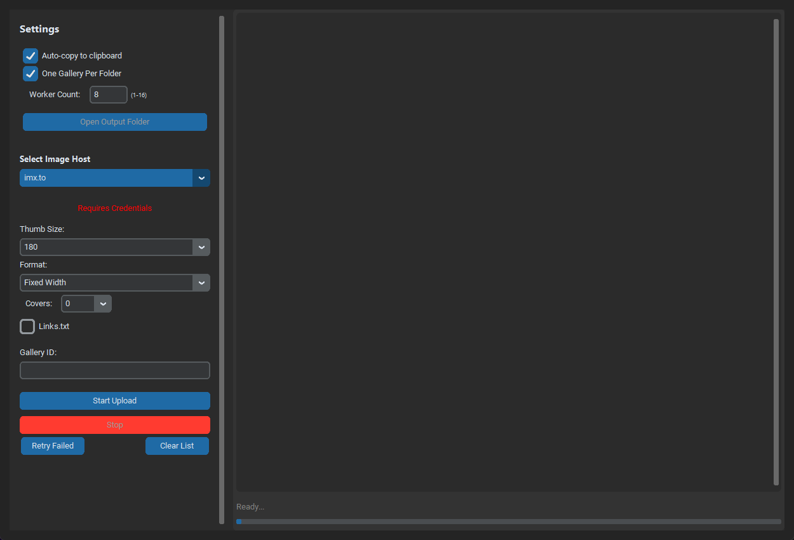
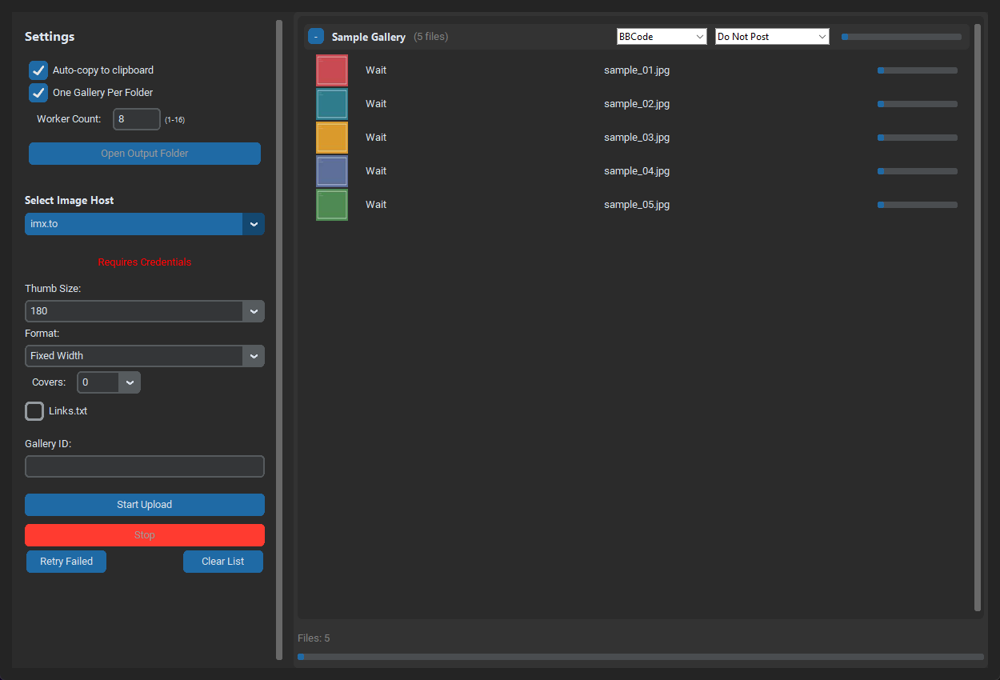
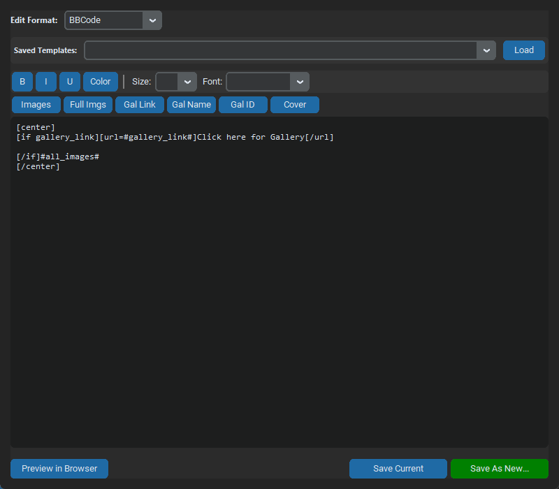

# Connie's Uploader Ultimate User Tutorial

This tutorial walks through Connie's Uploader Ultimate from first launch through batch uploads, galleries, templates, output files, ViperGirls posting, and every setting exposed by the current desktop app.

The program is a desktop image uploader. You add image files or folders, choose an image host, adjust service settings, start the upload, and receive formatted output text such as BBCode, Markdown, HTML, or a custom template.

## Main Window



The window is split into two main areas:

- The left settings panel controls output behavior, worker count, selected host, and service-specific upload options.
- The large right panel is the upload queue. Added files appear here as batches, with thumbnails, status labels, progress bars, per-batch template selection, and optional ViperGirls posting selection.

The bottom status text shows the current state, such as `Ready...`, `Processing...`, `Files: 5`, `Starting...`, or `All batches finished.` The bottom progress bar shows total upload progress.

## Basic Upload Workflow

1. Open the program.
2. Set any needed credentials from `Tools > Set Credentials`.
3. Choose an image host from `Select Image Host`.
4. Add files with `File > Add Files`, add a folder with `File > Add Folder`, or drag files/folders into the app.
5. Review the generated batch groups in the upload queue.
6. Choose a template for each batch if you do not want the default.
7. Choose a ViperGirls thread for each batch only if you want automatic posting.
8. Click `Start Upload`.
9. When complete, open the generated text files from `Output/` or use `Open Output Folder`.

## Adding Files And Folders

Use `File > Add Files` to select individual images. Selected loose files go into one `Miscellaneous` batch unless `View > Separate Batches for Files` is enabled.

Use `File > Add Folder` to add an entire folder. The program scans the folder for supported image formats and creates a batch named after the folder. If the selected folder contains subfolders, the app may ask whether to scan recursively or add each immediate subfolder as its own batch.

You can also drag files or folders into the main window or queue area.

Supported extensions are:

```text
.jpg, .jpeg, .png, .gif, .bmp, .webp
```

The app validates files before adding them. The default per-file size limit is 50 MB, and a single scan is capped at 1000 files.

## Upload Queue



Each batch header contains:

- Collapse/expand button: hides or shows the files in that batch.
- Batch name: usually the folder name or `Miscellaneous`.
- File count or completion state.
- Template dropdown: chooses the output template for that batch.
- Thread dropdown: chooses a saved ViperGirls thread or `Do Not Post`.
- Batch progress bar.

Each file row contains:

- A thumbnail preview or `[Img]` placeholder.
- A status label such as `Wait`, `Uploading`, `Done`, `Failed`, or `Timeout`.
- The file name.
- A `Set Cover` button that marks that image as a cover for templates and cover-size uploads.
- A file progress bar.

Queue actions:

- Drag batch headers to reorder batches.
- Drag file rows to reorder files or move them between batches.
- Use `Set Cover` on one or more rows to choose cover images manually. Right-click selected rows to mark or clear covers in bulk.
- Right-click a batch and choose `Delete Batch` to remove it.
- Right-click a file and choose `Delete Image` to remove that file.
- `Retry Failed` resets failed files to pending and starts another upload pass.
- `Clear List` removes all batches, queued files, generated progress, and current output references.

## Main Settings

These settings appear at the top of the left panel.

| Setting | What it does | When to use it |
| --- | --- | --- |
| `Auto-copy to clipboard` | Copies completed output text to the clipboard. Multiple completed batches are copied with blank lines between them. | Enable when you usually paste results into a forum, CMS, chat, or document immediately after upload. |
| `One Gallery Per Folder` | Tries to create a separate gallery for each batch/folder on services that support gallery creation. | Enable for folder-based uploads where each folder should become its own gallery. |
| `Worker Count` | Sets the Go sidecar's global worker pool count. The sidecar clamps this to 1 through 16 workers. | Use lower values for fragile services, slower networks, or strict rate limits. Use higher values for faster bulk uploads when the host tolerates it. |
| `Open Output Folder` | Opens the `Output/` directory after output files have been generated. It is disabled until there is output to open. | Use after a completed upload to inspect generated `.txt` files. |
| `Select Image Host` | Chooses the active upload service. The service-specific settings below change based on this selection. | Set this before starting the upload. |

### Worker Count Guidance

`Worker Count` controls the persistent Go sidecar process that performs upload work. A value of `1` is the most conservative and effectively forces sequential uploads. Values such as `4` or `8` are better for normal batches. Values near `16` are only useful when the host and network can handle that much concurrency.

## Service Settings

The service settings panel changes when you choose a host from `Select Image Host`.

### `imx.to`

`imx.to` requires an API key for uploads. Username/password are also used for gallery management and automatic gallery creation.

| Setting | Options | Explanation |
| --- | --- | --- |
| `Thumb Size` | `100`, `180`, `250`, `300`, `600` | Thumbnail width used by IMX output links. Larger values produce larger thumbnails in generated output. |
| `Format` | `Fixed Width`, `Fixed Height`, `Proportional`, `Square` | Controls how IMX creates thumbnails. Use `Fixed Width` for most forum posts. Use `Square` when you need uniform grid thumbnails. |
| `Auto Covers` | `0` through `10` | Marks the first N files as covers when they are added. Manual row-level cover choices can override this per batch. Cover uploads use larger thumbnail settings. |
| `Links.txt` | On/off | Also writes a raw link list file next to the formatted output file. |
| `Gallery ID` | Text field | Existing IMX gallery ID. Leave blank unless you want the upload attached to a specific gallery. |

If `One Gallery Per Folder` is enabled, the app tries to create a new IMX gallery for each batch using the batch title. This requires IMX username/password credentials, not just the API key.

### `pixhost.to`

Pixhost does not require credentials.

| Setting | Options | Explanation |
| --- | --- | --- |
| `Content` | `Safe`, `Adult` | Marks the upload content type. Choose accurately for the host's rules. |
| `Thumb Size` | `150`, `200`, `250`, `300`, `350`, `400`, `450`, `500` | Thumbnail size used by Pixhost output links. |
| `Auto Covers` | `0` through `10` | Marks the first N files as covers when they are added. Manual row-level cover choices can override this per batch. |
| `Links.txt` | On/off | Also writes a raw link list file next to the formatted output file. |
| `Gallery Hash (Optional)` | Text field | Existing Pixhost gallery hash. Leave blank for no manual gallery. |

If `One Gallery Per Folder` is enabled, the app creates a Pixhost gallery for each batch and finalizes created Pixhost galleries after uploads finish.

### `turboimagehost`

TurboImageHost login is optional.

| Setting | Options | Explanation |
| --- | --- | --- |
| `Thumb Size` | `150`, `200`, `250`, `300`, `350`, `400`, `500`, `600` | Thumbnail size used by TurboImageHost output links. |
| `Auto Covers` | `0` through `10` | Marks the first N files as covers when they are added. Manual row-level cover choices can override this per batch. |
| `Links.txt` | On/off | Also writes a raw link list file next to the formatted output file. |
| `Gallery ID` | Text field | Existing gallery ID, when applicable. |

Add Turbo credentials in `Tools > Set Credentials` if you need account-based uploads or host features that require login.

### `vipr.im`

Vipr requires credentials.

| Setting | Options | Explanation |
| --- | --- | --- |
| `Thumb Size` | `100x100`, `170x170`, `250x250`, `300x300`, `350x350`, `500x500`, `800x800` | Thumbnail dimensions used by Vipr output links. |
| `Auto Covers` | `0` through `10` | Marks the first N files as covers when they are added. Manual row-level cover choices can override this per batch. |
| `Links.txt` | On/off | Also writes a raw link list file next to the formatted output file. |
| `Refresh Galleries / Login` | Button | Logs in with saved Vipr credentials and loads your galleries into the dropdown. |
| Gallery dropdown | `None` plus loaded gallery names | Selects the Vipr gallery to attach uploads to. |

If the gallery list is empty, verify your Vipr credentials in `Tools > Set Credentials`, then click `Refresh Galleries / Login`.

### `imagebam.com`

ImageBam authentication is optional. Without saved credentials, uploads use the available unauthenticated flow when possible.

| Setting | Options | Explanation |
| --- | --- | --- |
| `Content Type` | `Safe`, `Adult` | Marks the upload content type. Choose accurately for the host's rules. |
| `Thumb Size` | `100`, `180`, `250`, `300` | Thumbnail size used by ImageBam output links. |

ImageBam does not expose a `Links.txt` checkbox in the current main panel.

### `imgur.com`

The plugin system discovers `imgur.com`, so it can appear in the host dropdown. In the current main window implementation, there is no dedicated Imgur settings panel in the static service settings area. The plugin metadata supports anonymous/authenticated upload concepts, thumbnail sizes, content type, album ID, and titles, but those controls are not exposed in this main settings panel yet.

If you choose Imgur, verify the behavior with a small test batch before relying on album or content-type settings.

## Credentials

Open credentials with `Tools > Set Credentials`.

The credentials dialog saves secrets through the operating system keyring instead of storing passwords in `user_settings.json`.

Credential tabs:

| Tab | Fields | Used for |
| --- | --- | --- |
| `imx.to` | `IMX API Key`, `Username`, `Password` | IMX uploads, gallery listing, gallery creation, and attaching uploads to galleries. |
| `ViperGirls` | `Username`, `Password` | Automatic forum posting through ViperGirls tools. |
| `Turbo` | `Username`, `Password` | Optional TurboImageHost authenticated uploads. |
| `Vipr` | `Username`, `Password` | Vipr uploads and gallery refresh. |
| `ImageBam` | `Email/User`, `Password` | Optional ImageBam authenticated uploads. |

Use `Save All` to store all fields. Use `Cancel` to close without saving changes.

## Gallery Manager


Open it with `Tools > Manage Galleries`.

The Gallery Manager supports `imx.to`, `pixhost.to`, and `vipr.im`.

Controls:

- `Service`: choose which host's galleries to show.
- `Refresh`: reload gallery data.
- `Your Galleries`: lists fetched galleries and their IDs/hashes.
- `Select`: sends the chosen gallery ID/hash back to the main window.
- `New Gallery Name`: name to use when creating a new gallery.
- `Create Gallery`: creates a gallery on the selected service.
- `Load Next Page`: appears for IMX gallery pagination.
- `Login Failed? Set Cookies Manually`: appears for IMX when normal login/listing fails; it lets you paste a `PHPSESSID` cookie value.

Use Gallery Manager when you want to attach a batch to an existing gallery or create a gallery before uploading.

## Template Editor



Open it with `Tools > Template Editor`.

Templates control the text files generated after upload. Each batch can choose a template from its batch header dropdown.

### Template Editor Controls

| Control | Explanation |
| --- | --- |
| `Edit Format` | Selects the template currently being edited. |
| `Category` | Filters built-in and custom templates by category. |
| `Search` | Filters template dropdowns by template name or content. |
| `Saved Templates` | Selects an existing template to load into the editor. |
| `Load` | Loads the chosen saved template. |
| `Duplicate` | Copies the current template to a new name. |
| `Rename` | Renames the current template while keeping its content. |
| `Delete` | Deletes the current template after confirmation. |
| `Import` | Imports templates from a JSON export file. |
| `Export` | Exports saved templates to JSON. |
| `B`, `I`, `U` | Inserts or wraps selected text with bold, italic, or underline formatting. |
| `Color` | Chooses a color and inserts/wraps color markup. |
| `Size` | Inserts/wraps size markup. |
| `Font` | Inserts/wraps font markup. |
| `Placeholders` | Switches between Images, Gallery, Batch, Service, and ViperGirls placeholder groups, including image-loop snippets. |
| `Preview in Browser` | Opens a local browser preview using added local files and shows both rendered output and raw generated text. Add files to the queue before using this. |
| `Copy Preview Output` | Copies the raw generated preview text without opening the browser. |
| `Save Current` | Saves changes to the currently selected template name. |
| `Save As New...` | Creates a new named template. |

The editor warns before switching templates or closing if the current template has unsaved changes. Templates are validated before saving so empty templates, unknown `#placeholder#` values, unclosed `[if]` or `[for image]` blocks, and templates without image output placeholders are blocked.

If preview data is not available, the editor explains what is missing instead of failing silently. Add at least one image to the upload queue before using browser preview or copying preview output.

### Built-In Templates

The app starts with built-in template categories:

| Category | Templates |
| --- | --- |
| `BBCode` | `BBCode`, `Basic List`, `Cover + Gallery ID` |
| `Markdown` | `Markdown`, `Reddit Markdown` |
| `HTML` | `HTML`, `HTML Page Wrapper` |
| `Forum` | `Vipr Forum (Center)`, `Vipr Forum (Simple)` |
| `ViperGirls` | `ViperGirls Gallery Post`, `ViperGirls Compact Grid`, `ViperGirls Full Image Post` |
| `Custom` | Templates you create, duplicate, rename, or import. |

The ViperGirls templates are designed for forum posting:

- `ViperGirls Gallery Post`: batch title, optional gallery link, selected target/thread metadata, and clickable thumbnails.
- `ViperGirls Compact Grid`: dense thumbnail grid using `[for image separator=space]`.
- `ViperGirls Full Image Post`: full/direct image embeds separated by blank lines, with an optional gallery link.

Custom templates are saved in `~/.conniesuploader/templates.json`. Existing `user_templates.json` files are migrated into that location the first time the updated app runs.

### Template Placeholders

| Placeholder | Meaning |
| --- | --- |
| `#all_images#` | All uploaded images formatted as clickable thumbnails for the selected template format. |
| `#all_full_images#` | All uploaded images formatted as full/direct image embeds. |
| `#image_url#` | Viewer page URL for the first image when used directly, and for each image inside per-image formats. |
| `#thumb_url#` | Thumbnail URL for the first image when used directly, and for each image inside per-image formats. |
| `#direct_url#` | Direct image URL for the first image when used directly, and for each image when the service provides or derives one. |
| `#gallery_link#` | Gallery URL built from the selected or created gallery. |
| `#gallery_name#` | Batch title. |
| `#gallery_id#` | Gallery ID or hash. |
| `#cover_url#` | Thumbnail URL of the first selected cover image, or the first successful upload when no cover is selected. |
| `#thumb_size#` | Thumbnail size used for the selected service. |
| `#image_count#` | Number of images in the generated batch output. |
| `#batch_name#` | Batch title. |
| `#upload_date#` | Current preview/upload date. |
| `#service#` | Selected service label or preview service. |
| `#thread_name#` | Selected ViperGirls target name in preview/posting contexts. |
| `#thread_id#` | Selected ViperGirls thread ID in preview/posting contexts. |

If a template contains one or more `#cover_url#` placeholders, the template engine uses selected cover thumbnails first and excludes those cover images from `#all_images#` so they are not duplicated.

### Template Conditionals

Templates support simple conditional blocks:

```text
[if gallery_link]
[url=#gallery_link#]Open Gallery[/url]
[/if]
```

These `[if]`, `[else]`, and `[/if]` tags are Connie's Uploader template syntax, not ViperGirls BBCode. The app resolves them before saving output or posting to ViperGirls, so raw conditional tags should not appear in forum posts.

Conditionals can be nested:

```text
[if gallery_link]
[url=#gallery_link#]Open Gallery[/url]
[if thread_id]Posting to thread #thread_id#[/if]
[else]
No gallery created
[/if]
```

You can also compare values:

```text
[if gallery_id=PREV_123]Preview gallery[/if]
```

Conditionals may include an else branch:

```text
[if gallery_link]Gallery ready[else]No gallery[/if]
```

### Template Image Loops

Use `[for image]...[/for]` when you want full control over each image instead of using `#all_images#` or `#all_full_images#`.

```text
[for image separator=newline]
[url=#image_url#][img]#thumb_url#[/img][/url]
[/for]
```

Inside an image loop, `#image_url#`, `#thumb_url#`, and `#direct_url#` refer to the current image. Other placeholders such as `#batch_name#`, `#service#`, `#thread_name#`, and `#thread_id#` remain available.

Supported separators:

| Separator | Output between image blocks |
| --- | --- |
| `separator=space` | One space. |
| `separator=newline` | One line break. |
| `separator=blankline` | A blank line. |
| `separator=none` | No separator. |
| `separator=", "` | A custom quoted separator. |

Conditionals also work inside loops:

```text
[for image separator=blankline]
[if direct_url][img]#direct_url#[/img][else][url=#image_url#]#image_url#[/url][/if]
[/for]
```

## Output Files

When a batch finishes, the app generates formatted text for that batch.

Files are written to:

```text
Output/
```

A persistent history copy is also written to:

```text
~/.conniesuploader/history/
```

Output filenames use the batch title plus a timestamp, for example:

```text
Sample_Gallery_20260522_0859.txt
```

If `Links.txt` is enabled for a supported service, the app also writes:

```text
Sample_Gallery_20260522_0859_links.txt
```

That links file contains raw viewer links, one per line.

## ViperGirls Posting

The app can automatically post completed batch output to saved ViperGirls threads.

Setup:

1. Open `Tools > Set Credentials`.
2. Add ViperGirls username and password.
3. Open `Tools > ViperGirls Posting Targets`.
4. Add saved threads by URL or thread ID. The saved name is fetched from the live ViperGirls thread title when available; optional tags and notes can help organize frequent targets.
5. Add files to the main queue.
6. For each batch, choose a saved thread from the thread dropdown.
7. Choose a ViperGirls template such as `ViperGirls Gallery Post`, `ViperGirls Compact Grid`, or `ViperGirls Full Image Post`.
8. Use `Preview Post` on a batch if you want to review the generated BBCode shape before uploading.
9. Start the upload.

If the batch thread dropdown remains `Do Not Post`, no forum post is queued.

Enable `Confirm before ViperGirls posting` in Settings to review the batch name, selected thread, thread ID, and generated post preview before uploads begin.

The targets manager supports search, sorting by name, last used time, or thread ID, and per-target validation. Use `Refresh Names` to update existing saved targets from the current ViperGirls thread titles. Use the checkboxes to bulk export or delete selected targets. `Import` and `Export All` move saved targets between installs using JSON files.

Posting happens in batch order. The auto-poster waits briefly between posts to reduce rate-limit problems. A target's `Last used` value updates after a successful post. Successful and failed posting attempts are saved in `Tools > ViperGirls Posting History`, where you can copy post text, copy an error, open the target thread, or clear the history.

If no posting targets exist, the targets manager shows an empty state with import/add guidance. If a search has no matches, clear or change the search text to return to the full list.

Saved thread data is stored under:

```text
~/.conniesuploader/saved_threads.json
```

## Menus

### File

| Menu item | Explanation |
| --- | --- |
| `Add Files` | Opens a file picker for individual images. |
| `Add Folder` | Opens a folder picker and scans for images. |
| `Exit` | Gracefully stops uploads, the auto-poster, thumbnail workers, and the sidecar. |

### Tools

| Menu item | Explanation |
| --- | --- |
| `Template Editor` | Opens the template editor. |
| `Set Credentials` | Opens the credential tabs and saves secrets to the OS keyring. |
| `Manage Galleries` | Lists, selects, and creates galleries for supported hosts. |
| `ViperGirls Posting Targets` | Manages saved ViperGirls posting targets. |
| `ViperGirls Posting History` | Shows saved posting attempts with copy/open actions. |
| `Set Thread Limit` | Sets per-service thread values from `1 Threads` through `10 Threads` for the current session/settings. |
| `Install Context Menu` | On Windows, adds an Explorer directory context menu entry named `Upload with Connie's Uploader`. |

### View

| Menu item | Explanation |
| --- | --- |
| `Execution Log` | Opens a log window showing app and sidecar events. Use this first when diagnosing upload failures. |
| `Show Image Previews` | Enables thumbnails in the upload queue. Disable for very large batches if you want faster queue population and lower memory use. |
| `Separate Batches for Files` | When enabled, loose files selected together become separate one-file batches instead of one `Miscellaneous` batch. |
| `Appearance Mode > System` | Follows the operating system appearance. |
| `Appearance Mode > Light` | Forces light mode. |
| `Appearance Mode > Dark` | Forces dark mode. |

## Recommended Settings By Scenario

| Scenario | Suggested settings |
| --- | --- |
| First test upload | `Worker Count: 1`, `Auto-copy: off`, `Links.txt: on`, 2 or 3 small files. |
| Normal forum batch | `Worker Count: 4-8`, `Auto-copy: on`, service thumbnail around 180-250, `BBCode` template. |
| One gallery per folder | Add folders instead of loose files, enable `One Gallery Per Folder`, use a gallery-capable service. |
| Very large batch | Disable `Show Image Previews`, use moderate worker count, keep `Execution Log` available. |
| Strict or flaky host | Use `Worker Count: 1-2`, fewer files per batch, and `Retry Failed` for transient failures. |

## Configuration And Data Locations

| Data | Location |
| --- | --- |
| App settings | `user_settings.json` |
| Custom templates | `~/.conniesuploader/templates.json` |
| Output for current sessions | `Output/` |
| Persistent output history | `~/.conniesuploader/history/` |
| Saved ViperGirls posting targets | `~/.conniesuploader/saved_threads.json` |
| ViperGirls posting history | `~/.conniesuploader/posting_history.json` |
| Credentials | Operating system keyring |
| Crash/debug log | `crash_log.log` |

## Troubleshooting

### Uploads fail immediately

Open `View > Execution Log` and check the sidecar message. Also verify credentials, selected service, content type, gallery ID/hash, and file size.

### The selected service requires credentials

Open `Tools > Set Credentials`, fill the service tab, click `Save All`, then restart or retry the upload.

### Vipr galleries do not load

Confirm `Vipr` credentials in `Tools > Set Credentials`, then select `vipr.im` and click `Refresh Galleries / Login`.

### IMX gallery login fails

Open `Tools > Manage Galleries`, select `imx.to`, and use the manual cookie option if it appears. You can paste a `PHPSESSID` cookie value when normal login fails.

### The queue is slow with many images

Disable `View > Show Image Previews` before adding the files. You can also split the upload into smaller folders.

### Output was generated but not copied

Check whether `Auto-copy to clipboard` was enabled before upload completion. You can still open `Output/` and copy the generated text manually.

### Nothing posts to ViperGirls

Make sure the batch header thread dropdown is not `Do Not Post`, ViperGirls credentials are saved, and the saved thread URL contains a recognizable thread ID such as `threads/12345` or `t=12345`. Open `Tools > ViperGirls Posting Targets`, select the target, and click `Validate`.

### ViperGirls posting preflight blocks upload

Upload Checks blocks the upload if posting is enabled but credentials are missing, a selected target was deleted, or a selected target has no parseable thread ID. Use the `Set Credentials` or `Manage ViperGirls Targets` action in Upload Checks, then retry.

### A ViperGirls post fails after upload

Open `Tools > ViperGirls Posting History`. Use `Copy Post` to keep the generated text, `Copy Error` for diagnostics, or `Open` to inspect the target thread. Failed attempts do not update a target's `Last used` value.

### The app cannot find the uploader sidecar

Build or restore `uploader.exe` on Windows, or `uploader` on Linux/macOS. The desktop app communicates with that sidecar for uploads and thumbnail generation.

## Responsible Use

Only upload content you have the right to share, and follow each host's terms of service. Content-type settings such as `Safe`, `Adult`, or `NSFW` should match the uploaded material.
